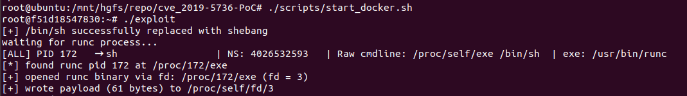
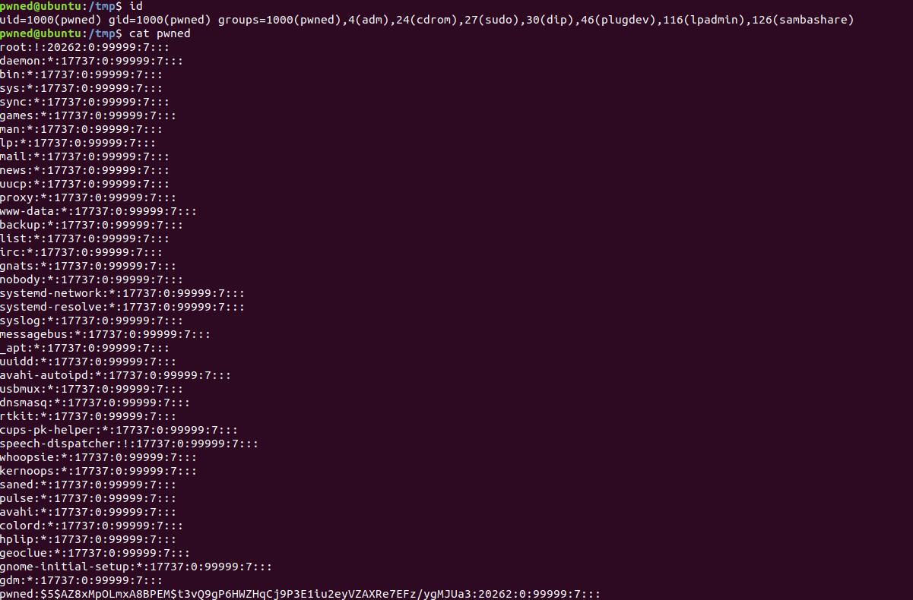

# CVE-2019-5736 PoC

This repository contains a C-based proof-of-concept exploit for [CVE-2019-5736](https://nvd.nist.gov/vuln/detail/CVE-2019-5736).

This vulnerability allows a malicious Docker container to overwrite the host's `runc` binary and execute arbitrary commands on the host with root privileges – fully compromising the host system.

> Inspired by the original Go-based PoC by [Frichetten](https://github.com/Frichetten/CVE-2019-5736-PoC?tab=readme-ov-file)

## Disclaimer

This code is for **educational purposes only**. Do not run it on any system you do not own or have permission to test. Misuse may result in legal consequences.

## Contents

1. [Project Structure](#1-project-structure)
2. [Environment Setup & Installation](#2-environment-setup--installation)
3. [Usage](#3-usage)  

## 1. Project Structure

```
.
├── docker/                       
│   └── Dockerfile
├── lib/                           
│   └── exploit.h
├── scripts/                       
│   ├── build_docker.sh
│   ├── purge_docker_installation.sh
│   ├── setup_env.sh
│   ├── start_docker.sh
│   └── trigger_exploit.sh
├── src/                         
│   ├── exploit.c
│   └── main.c
├── LICENSE
├── Makefile
└── README.md
```

## 2. Environment Setup & Installation

This exploit has been tested on:

- **Ubuntu 18.04.1** → [Download ISO](https://old-releases.ubuntu.com/releases/18.04.1/)
- **Docker 18.09.1** → [Download binaries](https://download.docker.com/linux/static/stable/x86_64/docker-18.09.1.tgz)


### Step-by-step Installation

#### 0. Install dependencies
```bash
sudo ./scripts/install_dependencies.sh
```
> Note: You can safely skip this if you already have installed `wget` and `build-essential`.

#### 1. Install Docker via script
```bash
sudo ./scripts/setup_env.sh
```

> This script installs Docker without systemd or socket activation. It’s ideal for VM labs.

#### 2. Start Docker manually
```bash
sudo dockerd
```

> Note: You’ll need a second terminal to run this in the background.

#### 3. Build the exploit container
```bash
sudo ./scripts/build_docker.sh
```

> This script compiles the exploit and builds a Docker image with the binary inside.

> Note: You can also manually build the exploit binary by running `make`.

### Optional: Clean up the environment

You can completely remove Docker and restore the system to a pre-installation state:
```bash
sudo ./scripts/purge_docker_installation.sh
```

## 3. Usage
First we start our exploit container. You can either use this command:

```bash
sudo docker run -it --name exp --rm runc_exploit
```
or the included shell script:

```bash
sudo ./scripts/start_docker.sh
```

Inside the container we can now start our exploit binary:

```bash
./exploit -c "$COMAND"
```

> The binary takes three arguments: `-h` prints the usage message and `-c` defines the command string payload we want to execute on the host. The last `-d` argument toggles debug prints during execution. (eg. parsing information of `/proc`)

> Note: If the `-c` argument is not provided the exploit will execute `cp /etc/shadow > /tmp/pwned && chmod 644 /tmp/pwned`.

The exploit now waits for an incomming runc process on the host execute 

```bash
sudo ./scripts/trigger_exploit.sh
```

This script will open a new process inside the container executing `bin/sh` and therefore triggering the exploit.

> Note: You could also trigger the exploit by manually executing `docker exec` on the host but the timing is critical for the current PoC version to work. So it could take a few tries... 

If runc was exploited successfully you should see a similiar output:



We are now able to open our pwned shadow file:


